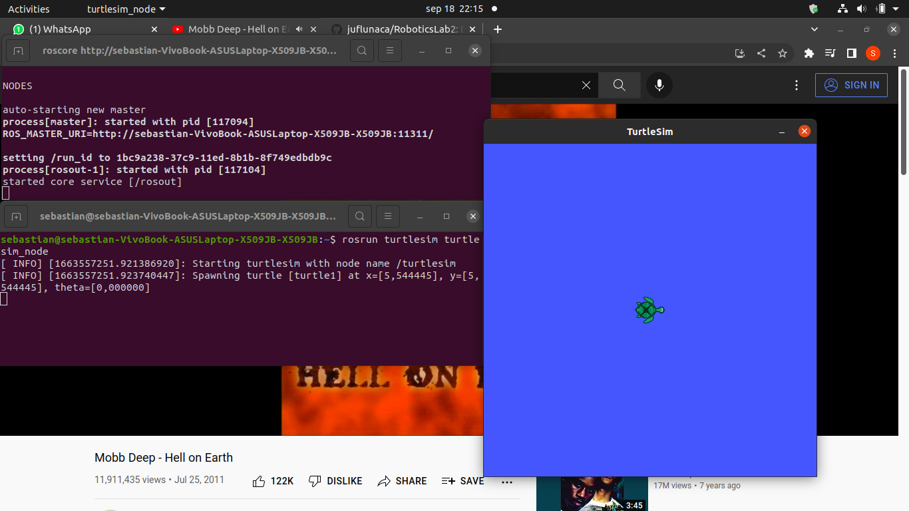

# Laboratorio 2 - Robótica de Desarrollo, Intro a ROS

### Por: Sebastian Campiño Figueroa, Julián Felipe Luna Castro y Diego Fernando Mejía Hernández

Este repositorio contiene las memorias y programas desarrollados durante la segunda practica de laboratorio de la materia Robótica. Esta practica esta orientada a familiarizarse con el programa ROS, sus comandos fundamentales y los de algunos de sus paquetes, asi como la forma en que podemos interactuar con el a traves de python o Matlab, para esto se crearon scripts en estos dos lenguajes de programacion que permiten enviar o recibir mensajes de ROS controlar los demos de turtlesim mediante el uso del teclado.

## Requerimientos
* Ubuntu 20.04 LTS o version compatible
* ROS Noetic 
* MATLAB 2015b o superior
* Robotics toolbox de mathworks
* Actitud y ganas de aprender

## 1. Familiarizarse con los comandos de mayor uso para la consola de Linux:
* **pwd:** "Print Working Directory", imprime la ruta del directorio en el que se encuentra abierta la terminal.
* **ls:** Muestra todos los subdirectorios y archivos que se encuentran en el directorio actual, se puede agregar la bandera -a para mostrar tambien archivos ocultos. 
* **cd:** Permite movernos entre directorios, dependiendo de los argumentos entregados.
* **touch:** Crea un nuevo archivo con el nombre que se le entregue como argumento.
* **rm:** "Remove", borra un archivo especificado.
* **mkdir:** Crea un nuevo subdirectorio en el directorio de trabajo actual.
* **rmdir:** Borra un directorio vacio especificado; esto es porque el comando "rm" no puede eliminar directorios, a menos que se agregue la bander -R, lo cual puede ser peligroso.
* **mv:** Usado para mover un archivo de un directorio a otro y tambien para cambiar los nombres de archivos. Puede ser usado para ambas cosas al tiempo.
* **cp:** Funciona de forma similar al comando "mv", pero creando una copia del archivo en vez de moviendo el original.
* **man:** Abre el manual del comando que se le entregue como argumento.Permite ver todas las formas en que se puede usar el comando, incluyendo bamderas para realizar acciones diferentes o complementarias.

## 2. Conexión de ROS con Matlab

En esta seccion del laboratorio se empezo abriendo dos terminales, uno para el nodo maestro de ROS y otro para iniciar el nodo *turtlesim_node* del paquete *turtlesim*, como podemos ver en la siguiente imagen:

Posteriormente en Matlab, nos conectamos con el nodo maestro con el comando rosinit:

imagenes/imagen2.png

Y procedemos a hacer las pruebas de envio de mensajes:

Este mensaje en particular genera un movimiento de la tortuga en la ventana de *turtlesim*:

Tambien se realizaron las pruebas del suscriptor en Matlab, que nos permite recibir los mensajes de cierto tipo que se envian a un topico, en este caso el topico es */turtle1/pose* y el tipo de mensaje es *turtlesim/Pose*.

Para el ultimo ejercicio en Matlab, creamos otro publicador como el visto anteriormente, pero esta vez asignamos un valor a todos los atributos del mensaje *geometry_msgs/Twist* antes de enviarlo, lo cual nos permite cambiar la pose de la tortuga con un solo mensaje.

Y finalmente podemos detener el nodo maestro desde matlab:

## 3. Conexión de ROS con Python

Se creo un script de Python llamado *myTeleopKey.py* de la forma estipulada en la guia para controlar el movimiento de la tortuga en *turtlesim* con el teclado. Este script se escribio dividiendo las tareas a realizar en diferentes funciones las cuales estan comentadas adecuadamente y pueden consultarse con mas detalle en el codigo base. Las funciones implementadas son:

* La tortuga se mueve hacia adelante y hacia atrás con las teclas W y S.
* La tortuga gira en sentido horario y antihorario con las teclas D y A, respectivamente.
* La tortuga vuelve a su posición y orientación central con la tecla R
* La tortuga da un giro de 180° con la tecla ESPACIO.
  
A continuacion podemos ver algunas capturas del funcionamiento del script:

## Conclusiones
* ROS funciona de manera independiente a Matlab o Python, los scripts desarrollados en estos programas solo nos permiten comunicarnos con los nodos.
* Eeeeehhhh...
* Aiuda :''v
